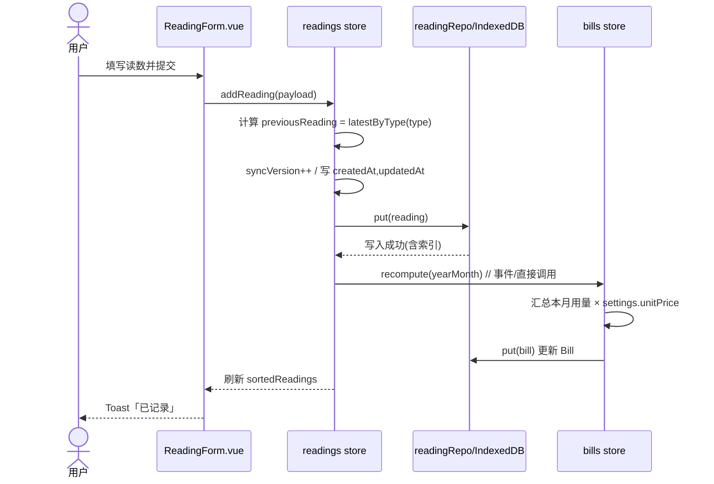
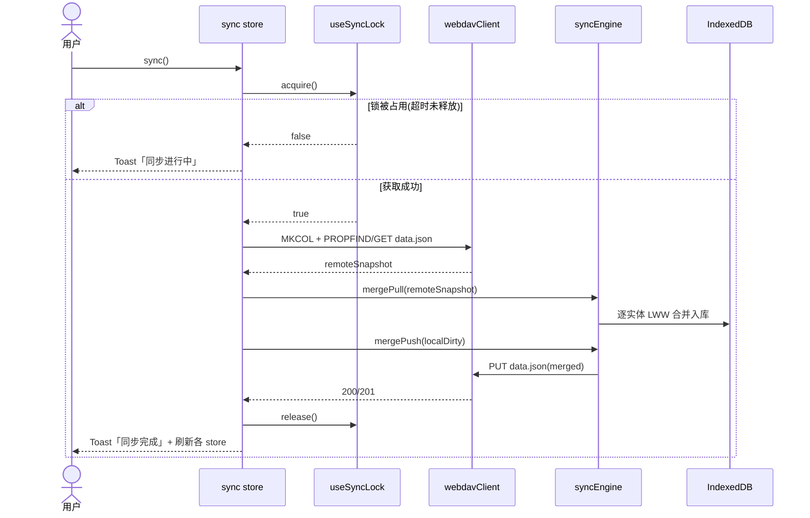

# 水电动账（SDB）系统设计与任务分解

> 角色：架构师 高见远（Gao）
> 技术栈：Vue 3 + TypeScript + Vite + Pinia + Vant 4 + ECharts + dayjs + vite-plugin-pwa
> 目标：离线优先、跨端（手机+PC）、可安装的 PWA，用于记录每月电表/水表读数并自动生成水电账单。
> 本文档为工程蓝图，不含业务代码，仅定义结构、接口与实现顺序。

---

## 1. 实现方案与框架选型

### 1.1 技术栈确认

| 层 | 选型 | 说明 |
|---|---|---|
| 构建 | Vite 5 | 通过 `vite-plugin-pwa` 生成 PWA（manifest + service worker，离线缓存 `dist`）。 |
| 框架 | Vue 3.4（`<script setup>` + TS） | 组合式 API；核心逻辑下沉到 `composables/` 与 `stores/`，与 UI 解耦。 |
| 状态 | Pinia 2 | 5 个 store：readings / bills / budget / settings / sync。 |
| UI | Vant 4 | 移动端优先；通过 `styles/variables.css` 与响应式断点适配 PC（≥768px 双列布局）。 |
| 图表 | ECharts 5 | 经 `useECharts` 封装，统一 `dispose` 内存管理。 |
| 日期 | dayjs 1.11 | 月份键 `YYYY-MM`、格式化。 |
| 持久化 | 自定义 IndexedDB 封装 + `idb@8` | **不使用 vue-indexdb-sync**，自写 repository 层。 |
| 同步 | WebDAV（PROPFIND/GET/PUT/MKCOL） | 自写 `webdavClient`，基于 `syncVersion` 的 LWW 增量合并。 |
| 加密 | Web Crypto API（AES-256-GCM） | 仅加密 `SyncConfig.password`。 |

### 1.2 目录约定

- 所有源码位于 `src/`，按 `composables / stores / db / sync / components / views / types / utils / styles / router` 分层。
- 根目录直放 `package.json`、`vite.config.ts`、`tsconfig.json`、`index.html`、`public/`（PWA 图标）。
- 「Phase 1 创建」= 骨架与数据层；「后续 Phase 增量」= 各 Phase 叠加的视图/组件/逻辑。

### 1.3 构建与部署

- 开发：`npm run dev`（Vite dev server，PWA 在 dev 下不注册 SW，用 `devOptions.enabled` 可选开启）。
- 构建：`npm run build` → `dist/`；`npm run preview` 预览。
- 部署：静态托管 `dist/`（任意静态服务器 / GitHub Pages / 自有 NAS）。PWA 需 HTTPS（localhost 除外）。
- 安装：浏览器/系统触发 `beforeinstallprompt`，由 `usePWAInstall` 引导，避免重复提示。

---

## 2. 完整文件树（相对路径 + 职责）

```
SDB/                                   # 项目根（已存在，不新建子目录）
├─ package.json                        # 依赖与脚本           [Phase 1]
├─ vite.config.ts                      # Vite + PWA 配置       [Phase 1]
├─ tsconfig.json / tsconfig.node.json  # TS 配置             [Phase 1]
├─ index.html                          # 入口 HTML           [Phase 1]
├─ .env / .env.example                 # 环境变量（可选）     [Phase 1]
├─ public/
│  ├─ icons/ (pwa-192.png, pwa-512.png, maskable)  [Phase 1]
│  └─ favicon.svg                      #                   [Phase 1]
└─ src/
   ├─ main.ts                          # 应用入口，挂载 Pinia/Router/PWA  [Phase 1]
   ├─ App.vue                          # 根组件 + 布局壳 + 安装提示     [Phase 1]
   ├─ router/
   │  └─ index.ts                      # 7 个路由（懒加载）        [Phase 1]
   ├─ types/
   │  ├─ models.ts                     # Reading/Bill/Budget/Settings/SyncConfig 等 [Phase 1]
   │  └─ index.ts                      # 统一导出               [Phase 1]
   ├─ db/
   │  ├─ database.ts                   # 打开/初始化 IndexedDB、版本迁移   [Phase 1]
   │  ├─ schema.ts                     # object stores / indexes 定义      [Phase 1]
   │  └─ repositories/
   │     ├─ readingRepo.ts             # 读数 CRUD（含软删/增量查询）    [Phase 1]
   │     ├─ billRepo.ts                # 账单 CRUD                   [Phase 1]
   │     └─ kvRepo.ts                  # key-value：settings/budget/syncConfig [Phase 1]
   ├─ stores/
   │  ├─ readings.ts                   # 读数状态 + 用量计算         [Phase 1]
   │  ├─ bills.ts                      # 账单汇总/重算             [Phase 1]
   │  ├─ budget.ts                     # 预算设置 + 阈值预警         [Phase 5]
   │  ├─ settings.ts                   # 主题/默认视图/单价         [Phase 1/7]
   │  └─ sync.ts                       # 同步配置 + 状态机          [Phase 3]
   ├─ composables/
   │  ├─ useTheme.ts                   # 深浅主题切换 + CSS 变量应用   [Phase 1/7]
   │  ├─ usePWAInstall.ts              # 安装提示（去重）           [Phase 1]
   │  ├─ useECharts.ts                 # ECharts 封装 + dispose 管理  [Phase 4]
   │  ├─ useOnline.ts                  # 在线/离线监听             [Phase 3]
   │  └─ useSyncLock.ts                # 同步锁（防并发）           [Phase 3]
   ├─ sync/
   │  ├─ webdavClient.ts               # PROPFIND/GET/PUT/MKCOL 封装   [Phase 3]
   │  ├─ syncEngine.ts                 # 增量拉取/推送 + LWW 合并      [Phase 3]
   │  ├─ crypto.ts                     # AES-256-GCM 密码加密         [Phase 3]
   │  └─ lock.ts                       # 锁原语（localStorage 实现）   [Phase 3]
   ├─ components/
   │  ├─ common/                       # AppHeader / AppTabBar / EmptyState / SdbDialog [Phase 1]
   │  ├─ readings/
   │  │  ├─ ReadingForm.vue            # 读数录入表单             [Phase 2]
   │  │  ├─ QuickRecordDialog.vue      # 快速记录弹窗             [Phase 2]
   │  │  ├─ ReadingList.vue            # 列表 + 排序/筛选          [Phase 2]
   │  │  ├─ ReadingItem.vue            # 单行                     [Phase 2]
   │  │  └─ UnitPriceDialog.vue        # 单价设置                 [Phase 2]
   │  ├─ bills/
   │  │  ├─ BillCard.vue               # 账单卡片概览             [Phase 6]
   │  │  ├─ BillTemplateSelector.vue   # 模板选择                 [Phase 6]
   │  │  └─ templates/
   │  │     ├─ ReceiptTemplate.vue     # 超市小票                 [Phase 6]
   │  │     ├─ MinimalTemplate.vue     # 极简                     [Phase 6]
   │  │     ├─ CardTemplate.vue        # 卡片                     [Phase 6]
   │  │     └─ ReportTemplate.vue      # 专业报表                 [Phase 6]
   │  ├─ stats/
   │  │  ├─ TrendChart.vue             # 趋势折线                 [Phase 4]
   │  │  ├─ CompareChart.vue           # 月度对比柱状             [Phase 4]
   │  │  ├─ CostPieChart.vue           # 费用构成饼图             [Phase 4]
   │  │  └─ MetricCard.vue             # 指标卡片                 [Phase 4]
   │  ├─ budget/
   │  │  ├─ BudgetProgress.vue         # 进度条                   [Phase 5]
   │  │  └─ BudgetWarning.vue          # 预警提示                 [Phase 5]
   │  └─ sync/
   │     ├─ SyncStatus.vue             # 同步状态 UI              [Phase 3]
   │     └─ SyncSettings.vue           # WebDAV 配置表单          [Phase 3]
   ├─ views/
   │  ├─ Home.vue                      # 首页（本月概览+快捷入口） [Phase 1/2]
   │  ├─ Readings.vue                  # 读数记录页               [Phase 2]
   │  ├─ Bills.vue                     # 账单页                   [Phase 6]
   │  ├─ Stats.vue                     # 可视化统计页              [Phase 4]
   │  ├─ Budget.vue                    # 预算管理页               [Phase 5]
   │  ├─ Settings.vue                  # 个性化设置页             [Phase 7]
   │  └─ Sync.vue                      # 同步页                   [Phase 3]
   ├─ utils/
   │  ├─ dayjs.ts                      # 日期工具（monthKey 等）   [Phase 1]
   │  ├─ eventBus.ts                   # 事件总线                 [Phase 1]
   │  ├─ errorCodes.ts                 # 错误码常量               [Phase 1]
   │  ├─ logger.ts                     # 日志                     [Phase 1]
   │  ├─ response.ts                   # 统一响应类型             [Phase 1]
   │  ├─ format.ts                     # 数值/货币格式化           [Phase 1]
   │  └─ pdf.ts                        # PDF 导出（html2canvas+jspdf）[Phase 6]
   └─ styles/
      ├─ variables.css                 # 暖色生活风 CSS 变量（色板 token）[Phase 1]
      ├─ theme.css                     # 深浅主题覆盖             [Phase 1/7]
      └─ global.css                    # 全局基础样式 + 响应式断点   [Phase 1]
```

---

## 3. 数据模型与 IndexedDB Schema

### 3.1 TypeScript 类型定义（`src/types/models.ts`）

```ts
// ---------- 枚举 ----------
export type ReadingType = 'electricity' | 'water';
export type ThemeMode = 'light' | 'dark';
export type DefaultView = 'home' | 'readings' | 'bills' | 'stats' | 'budget';
export type BillTemplateId = 'receipt' | 'minimal' | 'card' | 'report';
export type BudgetStatus = 'ok' | 'warning' | 'exceeded';
export type SyncStatus = 'idle' | 'syncing' | 'success' | 'error';

// ---------- 同步元数据基类 ----------
export interface EntityBase {
  id: string;            // uuid v4
  createdAt: string;     // ISO 时间戳
  updatedAt: string;     // ISO 时间戳
  syncVersion: number;   // 每次本地变更 +1，LWW 依据
  isDeleted: boolean;    // 软删（墓碑），用于同步传播删除
}

// ---------- 读数记录 ----------
export interface Reading extends EntityBase {
  type: ReadingType;            // 电/水
  reading: number;              // 本次读数
  previousReading: number | null; // 上次读数（本地展示/校验用，可为 null）
  date: string;                 // 'YYYY-MM-DD' 读数所属日期
  note?: string;
}

// ---------- 月度账单 ----------
export interface Bill extends EntityBase {
  id: string;                   // = yearMonth，如 '2025-08'
  yearMonth: string;            // 'YYYY-MM'
  electricityUsage: number;     // 用电量（度）
  electricityCost: number;      // 电费（元）
  waterUsage: number;           // 用水量（吨）
  waterCost: number;            // 水费（元）
  totalCost: number;            // 合计（元）
  budgetStatus: BudgetStatus;   // 预算状态（由 budget store 计算回写）
  generatedAt: string;          // 生成/重算时间
}

// ---------- 预算设置（单条 kv） ----------
export interface Budget {
  electricityLimit: number;     // 电费限额（元）【口径见待明确】
  waterLimit: number;           // 水费限额（元）
  updatedAt: string;
}

// ---------- 单价配置（独立结构，挂在 Settings） ----------
export interface PriceConfig {
  electricity: number;          // 元/度
  water: number;                // 元/吨
}

// ---------- 应用设置（单条 kv） ----------
export interface Settings {
  theme: ThemeMode;
  autoPopQuickRecord: boolean;  // 启动是否自动弹快速记录
  defaultView: DefaultView;
  unitPrice: PriceConfig;       // 单价集中存放于此
  templateId: BillTemplateId;   // 默认账单模板
  updatedAt: string;
}

// ---------- WebDAV 同步配置（单条 kv，密码加密） ----------
export interface SyncConfig {
  url: string;                  // 如 https://dav.example.com
  username: string;
  passwordEnc: string;          // AES-256-GCM 密文（base64: iv|ciphertext）
  enabled: boolean;
  lastSyncAt?: string;
}
```

> **单价存放决策**：`unitPrice: PriceConfig` 放在 `Settings` 中（单条 kv），避免再开独立 store；如需多套房源不同单价（见待明确事项 6），后续可升级为 `priceRepo`。

### 3.2 IndexedDB Schema（`src/db/schema.ts`）

- 数据库名：`shuidian-dongzhang`，版本 `1`。
- Object Stores：

| Store | keyPath | Indexes | 说明 |
|---|---|---|---|
| `readings` | `id` | `type`、`date`、`createdAt`、`syncVersion`、`isDeleted` | 读数主表（含软删与同步版本） |
| `bills` | `id` | `yearMonth`、`syncVersion` | 账单表（id=yearMonth） |
| `kv` | `key` | `updatedAt` | 存 `settings` / `budget` / `syncConfig` 单条记录 |

- `kv` 记录结构：`{ key: 'settings'|'budget'|'syncConfig', value: <对应对象>, updatedAt, syncVersion, isDeleted }`，以便同步时一并纳入 LWW。
- 索引用途：`type`+`date` 支持读数按类型/月份筛选排序；`syncVersion`/`isDeleted` 供增量同步扫描「本地脏数据」。

---

## 4. Pinia Store 结构

### 4.1 `readings` store
```
state:
  items: Reading[]
  loading: boolean
  filter: { type?: ReadingType; month?: string }
  sortBy: 'date' | 'reading' | 'createdAt'   // 默认 date desc
getters:
  sortedReadings: Reading[]                  // 应用 filter+sort
  latestByType(type): Reading | undefined    // 上一期读数（算 usage）
  usageOf(reading): number                   // reading.reading - previousReading
actions:
  load(): Promise<void>
  addReading(payload: Omit<Reading,'id'|'createdAt'|'updatedAt'|'syncVersion'|'isDeleted'|'previousReading'>): Promise<Reading>
  updateReading(id, patch): Promise<void>
  removeReading(id): Promise<void>            // 软删 + syncVersion++
  setFilter/setSort(p): void
```

### 4.2 `bills` store
```
state:
  bills: Record<string, Bill>   // key = yearMonth
  currentMonth: string
getters:
  billForMonth(m): Bill | undefined
  recentMonths(n): Bill[]
  totalOf(m): number
actions:
  load(): Promise<void>
  recompute(yearMonth): Promise<Bill>         // 读 readings → 汇总用量×单价 → 写 bill
  recomputeAll(): Promise<void>
```

### 4.3 `budget` store
```
state:
  electricityLimit: number
  waterLimit: number
getters:
  statusForBill(bill): BudgetStatus           // 任一超 80% warning，超 100% exceeded
  ratioFor(type, bill): number
  warnings(bill): { type, level }[]           // 80%/100% 触发
actions:
  load(): Promise<void>
  setBudget(patch): Promise<void>             // 持久化到 kv
  evaluate(bill): void                        // 回写 bill.budgetStatus
```

### 4.4 `settings` store
```
state:
  theme: ThemeMode
  autoPopQuickRecord: boolean
  defaultView: DefaultView
  unitPrice: PriceConfig
  templateId: BillTemplateId
getters:
  isDark: boolean
actions:
  load(): Promise<void>
  update(patch: Partial<Settings>): Promise<void>
  applyTheme(): void                          // 调 useTheme 写 CSS 变量
```

### 4.5 `sync` store
```
state:
  config: SyncConfig
  status: SyncStatus
  lastSyncAt?: string
  error?: string
  progress: { phase: string; done: number; total: number }
getters:
  isConfigured: boolean
actions:
  loadConfig(): Promise<void>
  saveConfig(patch): Promise<void>            // 密码经 crypto 加密后存
  testConnection(): Promise<boolean>
  sync(): Promise<void>                       // 主链路：加锁→拉→合并→推→解锁
  pushOnly(): Promise<void>
  pullOnly(): Promise<void>
```

---

## 5. WebDAV 同步协议

### 5.1 远程文件布局（默认：单全量快照）
```
<SyncConfig.url>/
  shuidian-dongzhang/
    data.json        # 全量快照（readings[]、bills[]、kv{settings,budget,syncConfig}）
```
> 数据量小（个人月度记录），采用单 `data.json` 全量读写最稳妥；若用户要求「按 store 分文件」（见待明确 3），可改为 `readings.json`/`bills.json`/`meta.json`，`syncEngine` 抽象 `loadRemote()/putRemote()` 即可切换。

### 5.2 方法用法
| 方法 | 用途 |
|---|---|
| `MKCOL /shuidian-dongzhang` | 首次同步时创建远端目录（已存在则忽略 405）。 |
| `PROPFIND /shuidian-dongzhang/data.json` (Depth:0) | 取远端文件 `getetag`/`getlastmodified`，判断是否存在/变更，决定是否需要 GET。 |
| `GET /shuidian-dongzhang/data.json` | 拉取远端快照。 |
| `PUT /shuidian-dongzhang/data.json` | 上传合并后的本地快照（带 `If-None-Match`/覆盖写）。 |

### 5.3 增量拉取/推送算法（基于 `syncVersion`）
```
sync():
  lock.acquire()                      # 失败则报 SDB_SYNC_LOCKED 退出
  try:
    remote = GET data.json (若无则 {})
    # ---- 拉取合并（Pull）----
    for each entity in remote:        # 遍历远端
        local = getLocal(entity.id)
        if local == null or LWW(remote, local) == remote:
            upsertLocal(entity)        # 远端更新
    # ---- 推送合并（Push）----
    dirty = scanLocalDirty()           # syncVersion 高于 remote 同 id，或仅本地存在
    merged = applyLocalDirty(remote, dirty)   # 本地脏数据覆盖远端
    PUT data.json(merged)
    update lastSyncAt / 清本地脏标记（syncVersion 已对齐）
  finally:
    lock.release()
```
- 「增量」体现于：Pull 仅接受远端较新实体；Push 仅把本地较新/新增实体写回，避免全量覆盖他人数据。

### 5.4 LWW 冲突解决规则
对同 `id` 的两边记录 `A`(本地) / `B`(远端)：
1. 若一方 `isDeleted=true` 而另一方有值：以 **syncVersion 高者** 决定；若 `syncVersion` 相等，**墓碑（删除）胜**（保守删除）。
2. 比较 `syncVersion`：**高者胜**。
3. `syncVersion` 相等时，比较 `updatedAt`（ISO 字符串字典序）：**较新者胜**。
4. 全部相等 → 视为同一版本，跳过。

### 5.5 同步锁（防并发）
- 实现：`useSyncLock` + `sync/lock.ts`，用 `localStorage` 存 `{ token: uuid, ts: number }`，键 `sdb:sync:lock`。
- 获取：`acquire()` 读取锁；若不存在或 `now-ts > TIMEOUT(5min)` → 写入本机 token 并返回 `true`；否则 `false`。
- 释放：`release(token)` 仅当 token 匹配时清除。
- 所有同步路径 `try/finally` 保证释放；超时兜底防止死锁。

### 5.6 AES-256-GCM 密码加密
- **密钥来源**：首次运行由 `crypto.getRandomValues(new Uint8Array(32))` 生成 256-bit 密钥，base64 存于 `localStorage['sdb:crypto:key']`（同设备可读；更强方案见待明确 4）。
- **Web Crypto 用法**：
  - `importKey('raw', keyBytes, 'AES-GCM', false, ['encrypt','decrypt'])`。
  - 加密：`iv = getRandomValues(12)`；`ct = encrypt({name:'AES-GCM', iv}, key, utf8(password))`；存储 `passwordEnc = base64(iv) + '|' + base64(ct)`。
  - 解密：`split` 出 iv/ct，反向 `decrypt`。
  - 失败抛 `SDB_CRYPTO_FAIL`，密钥永不落库到 WebDAV。

---

## 6. 模块 / 组件映射

| 视图 (views) | 路由 | 关键组件 | 对应 Phase |
|---|---|---|---|
| Home | `/` | AppHeader, MetricCard, BillCard, QuickRecordDialog | 1/2/4/6 |
| Readings | `/readings` | ReadingForm, ReadingList, ReadingItem, UnitPriceDialog | 2 |
| Bills | `/bills` | BillCard, BillTemplateSelector, 4 个 Template | 6 |
| Stats | `/stats` | TrendChart, CompareChart, CostPieChart, MetricCard | 4 |
| Budget | `/budget` | BudgetProgress, BudgetWarning, UnitPriceDialog | 5 |
| Settings | `/settings` | 主题/默认视图/单价/数据导入导出 | 7 |
| Sync | `/sync` | SyncSettings, SyncStatus | 3 |

- 通用壳：`App.vue` 含 `AppHeader` + `AppTabBar`（底部 Tab，PC 端转为侧栏）+ `usePWAInstall` 提示。

---

## 7. 程序调用流程（Mermaid 时序图）

### 7.1 记录一次读数 → 写入 IndexedDB → 触发账单重算


### 7.2 手动触发同步 → 加锁 → 拉取 → 合并 → 解锁


---

## 8. 有序任务列表（按 Phase，标注依赖与顺序）

> 工程师逐 Phase 实现，每 Phase 完成即验收。T 编号全局递增，依赖指「完成前置后才能开工」。

| Task ID | Phase | 任务名 | 源文件（新建/修改） | 依赖 | 优先级 |
|---|---|---|---|---|---|
| T01 | P1 | 脚手架与 PWA 骨架 | package.json, vite.config.ts, tsconfig*, index.html, public/, main.ts, App.vue, router/index.ts | — | P0 |
| T02 | P1 | 类型与基础设施 utils | types/models.ts, types/index.ts, utils/{dayjs,eventBus,errorCodes,logger,response,format}.ts | T01 | P0 |
| T03 | P1 | IndexedDB 持久化层 | db/database.ts, db/schema.ts, db/repositories/{readingRepo,billRepo,kvRepo}.ts | T02 | P0 |
| T04 | P1 | Pinia stores + 主题/安装 composables | stores/{readings,bills,settings}.ts, composables/{useTheme,usePWAInstall}.ts, styles/{variables,theme,global}.css, Home.vue, common/* | T02,T03 | P0 |
| T05 | P2 | 读数记录核心功能 | views/Readings.vue, components/readings/*, stores 增 addReading/recompute 联调 | T04 | P0 |
| T06 | P3 | WebDAV 同步全链路 | sync/{webdavClient,syncEngine,crypto,lock}.ts, composables/{useSyncLock,useOnline}.ts, stores/sync.ts, views/Sync.vue, components/sync/* | T04 | P0 |
| T07 | P4 | 可视化与统计 | composables/useECharts.ts, components/stats/*, views/Stats.vue | T04 | P1 |
| T08 | P5 | 预算管理 | stores/budget.ts, components/budget/*, views/Budget.vue | T04 | P1 |
| T09 | P6 | 账单生成与导出 | views/Bills.vue, components/bills/*, utils/pdf.ts | T05,T08 | P1 |
| T10 | P7 | 个性化与数据导入导出 | views/Settings.vue, stores/settings 扩展, 导入导出工具 | T04 | P2 |

**实现顺序**：T01→T02→T03→T04（Phase 1 完成可验收）→ T05（P2）→ T06（P3）→ T07（P4）→ T08（P5）→ T09（P6）→ T10（P7）。
T06 可与 T05 并行起步但需 T04 先落地；T09 依赖 T05/T08 已存在的数据结构。

---

## 9. 依赖包清单（`package.json` 片段）

```jsonc
{
  "dependencies": {
    "vue": "^3.4.0",
    "vue-router": "^4.3.0",
    "pinia": "^2.1.7",
    "vant": "^4.8.0",
    "echarts": "^5.5.0",
    "dayjs": "^1.11.10",
    "idb": "^8.0.0"
  },
  "devDependencies": {
    "vite": "^5.2.0",
    "@vitejs/plugin-vue": "^5.0.0",
    "typescript": "^5.4.0",
    "vue-tsc": "^2.0.0",
    "vite-plugin-pwa": "^1.0.0",
    "@types/node": "^20.12.0"
  },
  "scripts": {
    "dev": "vite",
    "build": "vue-tsc --noEmit && vite build",
    "preview": "vite preview"
  }
}
```
> Phase 6 PDF 导出追加：`jspdf@^2.5.1`、`html2canvas@^1.4.1`（或改用浏览器原生打印，见待明确 5）。样式若引入预处理器可加 `sass@^1.72`。

---

## 10. 共享知识 / 跨文件约定

### 10.1 错误码（`utils/errorCodes.ts`）
```
SDB_DB_OPEN_FAIL   // IndexedDB 打开失败
SDB_DB_WRITE_FAIL  // 写入失败
SDB_SYNC_LOCKED    // 同步锁被占用
SDB_WEBDAV_CONN    // WebDAV 连接/鉴权失败
SDB_WEBDAV_PUT     // 上传失败
SDB_CRYPTO_FAIL    // 加解密失败
SDB_NET_OFFLINE    // 离线无法同步
SDB_VALIDATE       // 表单/参数校验失败
```

### 10.2 日志（`utils/logger.ts`）
- 统一 `logger.info/warn/error(tag, msg, meta?)`，tag 形如 `[SDB:sync]`。
- 开发环境打印控制台；生产可降级（不传敏感字段，passwordEnc 绝不打印）。

### 10.3 事件总线（`utils/eventBus.ts`）
轻量发布订阅（可自写或 `mitt`）。约定事件：
- `reading:changed` → bills store 重算
- `bill:recalculated` → Stats/Budget 刷新
- `theme:changed` → 全局应用变量
- `sync:done` → 各 store `load()` 刷新
- `online:changed` → 触发待机同步

### 10.4 统一响应类型（`utils/response.ts`）
```ts
export interface Result<T> {
  code: number;        // 0 成功，非 0 见 errorCodes
  data?: T;
  message?: string;
}
```
同步相关返回 `SyncResult { status: SyncStatus; pulled: number; pushed: number; error?: string }`。

### 10.5 暖色生活风色板 token（`styles/variables.css`）
```css
:root {
  --sdb-primary: #FF8C42;        /* 暖橙 主色 */
  --sdb-primary-light: #FFB877;
  --sdb-primary-dark: #E76F24;
  --sdb-accent: #FFD166;         /* 暖黄 点缀 */
  --sdb-bg: #FFF9F2;             /* 米白暖底 */
  --sdb-surface: #FFFFFF;
  --sdb-surface-2: #FFF1E3;
  --sdb-text: #3D3027;           /* 暖棕黑 */
  --sdb-text-secondary: #8A7B6E;
  --sdb-success: #7CB342;        /* 暖绿 */
  --sdb-warning: #FFA000;
  --sdb-danger: #E5533D;
  --sdb-radius: 14px;
  --sdb-shadow: 0 4px 16px rgba(231,111,36,.12);
}
/* 深色主题覆盖 */
[data-theme="dark"] {
  --sdb-bg: #2B2420;
  --sdb-surface: #3A322C;
  --sdb-surface-2: #463B33;
  --sdb-text: #F5EBE0;
  --sdb-text-secondary: #B9A89B;
}
```
- 组件统一引用这些变量；Vant 主题通过 `--van-*` 变量覆盖（如 `--van-primary: var(--sdb-primary)`）。

---

## 11. 待明确事项（需主理人向用户拍板，勿擅自猜测）

1. **单价口径**：电费「元/度」还是阶梯计价？水费「元/吨」？是否需要阶梯电价/水价（影响 `PriceConfig` 结构，或升级为单价表）？
2. **预算限额口径**：按「费用金额(元)」还是「用量(度/吨)」设限？影响预警计算与 `Budget` 字段含义。
3. **同步远程布局**：单 `data.json` 全量快照 vs 按 store 分文件？默认全量快照（个人数据量小），但每次同步上传全量是否可接受？
4. **AES 密钥来源**：默认「设备本地随机密钥」（同设备可读，防 casual 窥探）；是否需要用户自定义加密口令（更强但需记忆）？
5. **PDF 导出方案**：`html2canvas + jsPDF`（体积大、像素化）还是仅模板预览 + 浏览器原生打印？Phase 6 据此定依赖。
6. **多房源/多表**：当前模型无房源/房间字段，是否仅支持单套房源单电表单水表？若需多套，需增加 `premiseId` 维度（影响数据模型与所有聚合）。
7. **账单与预算关系**：`Bill.budgetStatus` 由 `budget` store 计算回写（本设计采用）；还是账单自身独立预算？确认回写机制。
8. **LWW 同版本裁决**：`syncVersion` 相等时以 `updatedAt` 较新者胜，是否认可？（默认采用，需在用户确认范围内。）

---
## 12. 已确认决策（v1 · 主理人汇总，用户拍板）

基于用户确认，对第 11 节待明确项裁定如下，工程师据此实现：

- **D1 房源规模**：支持多套房源/多表。新增 `Premise` 实体与 `premises` store；`Reading`/`Bill` 增加 `premiseId`；`Bill.id = \`${premiseId}:${yearMonth}\``；单价与预算按房源独立存储（`prices`/`budgets` store，key=premiseId）。单房源场景下 UI 透明（首次启动预置一套「我的家」）。
- **D2 单价口径**：支持「固定单价」与「阶梯计价」两种，用户可切换。`PriceConfig = { mode:'flat'|'tiered'; flat:{electricity,water}; tiers:{ electricity:Tier[]; water:Tier[] } }`，`Tier={ upTo:number|null; price:number }`（末档 `upTo=null` 表示及以上）。从 `Settings` 移出，改为按房源存于 `prices` store。
- **D3 预算口径**：支持「按金额(元)」与「按用量(度/吨)」两种，用户可切换。`Budget = { premiseId; mode:'amount'|'usage'; electricityLimit; waterLimit; updatedAt; syncVersion; isDeleted }`，limit 含义随 mode 变化；80%/100% 预警按对应维度计算。
- **D4 加密密钥**：采用设备本地随机密钥（首次运行 `crypto.getRandomValues` 生成 256-bit，存 localStorage，AES-256-GCM），不依赖用户口令。
- **D5 同步远程布局**：单 `data.json` 全量快照（默认），`syncEngine` 抽象 `loadRemote/putRemote` 以便后续切换分文件。
- **D6 PDF 导出**：Phase 6 采用 `html2canvas + jsPDF`（追加依赖）；保留浏览器原生打印作为备选。
- **D7 LWW 同版本裁决**：`syncVersion` 相等时以 `updatedAt` 较新者胜（默认采纳）。
- **D8 账单-预算关系**：`Bill.budgetStatus` 由 `budget` store 计算回写（采纳原设计）。

> 文档结束。所有设计以「离线优先、核心逻辑与 UI 解耦、响应式跨端、可逐 Phase 验收」为约束。
